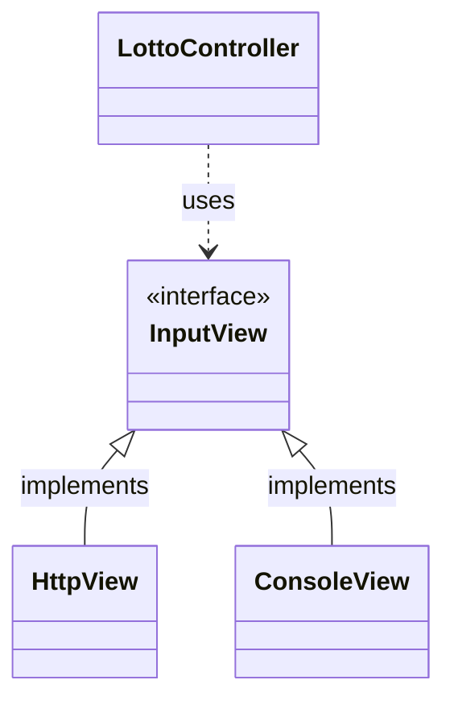
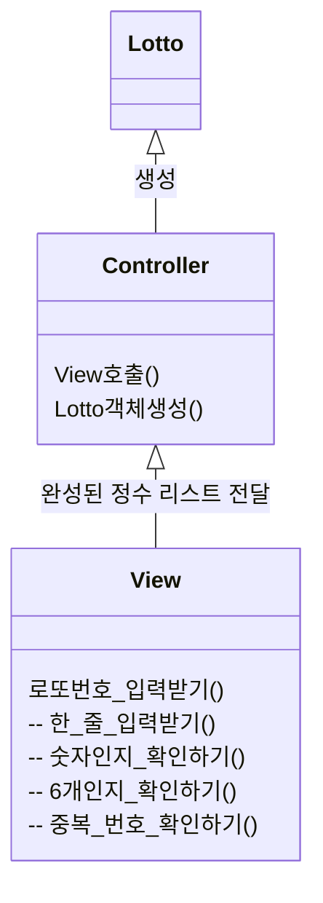
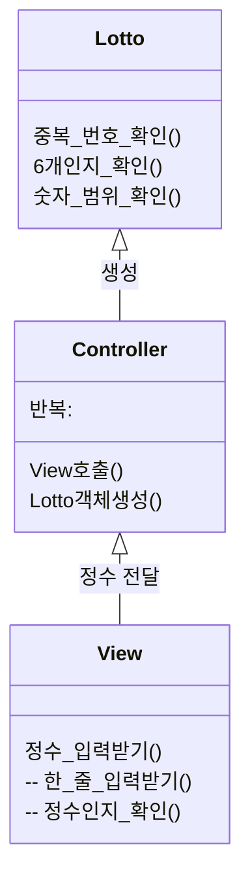

## MVC 패턴
본질적인 질문이지만, MVC 패턴을 왜 사용할까?

짧은 견해로는 뷰와 모델 부분을 완전히 분리하는 것으로 결합도를 낮추고,
요구사항이 변경되더라도 코드를 재사용할 수 있도록 하기 위하는 것이라 생각한다 [[1]], [[2]].

아래 사진은 Apple에서 발표한 Cocoa MVC 패턴[[1]], [[4]]을 표현하는 사진이다.
이번 글에서는 3주차 우테코 프리코스를 진행하면서 어떻게 MVC 패턴을 적용했는지,
코드의 재사용성을 높였는지,
그리고 고민한 부분이 무엇인지 소개하려고 한다.

참고로 3주차 과제의 요구사항은 [여기](https://github.com/metishonora/java-lotto-6/tree/metishonora)에서 확인할 수 있다.


### Model
- 데이터 관련 책임을 담당한다.
- 컨트롤러와 뷰에 의존하지 않아야 한다. 즉, 컨트롤러와 뷰의 필드, 메서드를 가져다 쓰지 않는다.

### View
- 사용자 인터페이스를 담당한다.
- 컨트롤러에 의존하지 않아야 한다.
- 모델로부터 동적인 데이터만 받는다. (*이 부분은 테코톡[[3]]의 내용을 재해석한 것입니다.*)
- 정적인 데이터는 자체적으로 처리한다.

### Controller
- 모델과 뷰를 연결한다.
- 모델에서 데이터를 받아 뷰에 전달한다.

## 고민한 부분

### 컨트롤러의 역할
입력은 컨트롤러 클래스가 받을 것인가, 혹은 뷰 클래스가 받을 것인가?
> 뷰와 컨트롤러의 결합이 커지면, 컨트롤러가 하나의 뷰에 종속적일 수밖에 없다. [[5]]

```java
// LottoController.java
// 사용자로부터 로또를 구입하기 위한 총 예산을 입력받는다.
int requestMoney() {
	...
	return Integer.parseInt(Console.readLine());
}
```
콘솔(터미널)로부터 한 줄을 받고 정수로 변환하는, 현재 요구사항을 만족하는 구현이다.
하지만 갑작스럽게 요구사항이 바뀌어, HTTP POST로 입력을 받아야 한다면 뷰와 더불어 컨트롤러의 코드도 바꿔야 할 것이다.
즉 컨트롤러가 Console이라는 하나의 뷰에 종속적이라 할 수 있겠다.


```java
// LottoController.java
int requestMoney() {
	...
	return inputView.requestInteger();
}
```
따라서 컨트롤러에서는 InputView라는 뷰 인터페이스를 사용하게 하였다.
만약 요구사항이 변할 경우, InputView의 구현체를 ConsoleView에서 다른 클래스로 변경한다면,
컨트롤러 코드를 변경하지 않고 요구사항을 만족할 수 있을 것이다.

### 에러 핸들링 책임

이번 과제에는 로또 당첨 번호를 콘솔에서 입력받는 부분이 있다.
- 올바른 예시: 1,2,3,4,5,6
- 오류 예시
	- 0,1,2,3,4,5 		(로또 번호는 1~45의 범위만 존재한다)
	- 10,10,10,10,10,10 	(중복된 번호를 가질 수 없다)
	- 1,3,5,7,9 		(6개의 번호를 선택해야 한다)
	- hello, world 		(숫자만 입력해야 한다)

입력이 들어왔을 때 각각의 에러 핸들링을 어디서 처리하는 게 코드 재사용성을 높일 수 있는가?

**후보 1: 뷰에 에러 핸들링을 위임하고, 컨트롤러에 전달하기**

(View의 메서드 **로또_번호_입력받기()**에서 하위 4개 메서드를 사용하는 것을 표현했다.)

화살표만 보면 뷰가 모델에 의존하지 않은 것 같지만, **암시적으로 의존한다**고 표현하고 싶다.
왜냐하면 요구 사항이 변하여 로또 개수가 7개 번호로 변한다면 어떻게 될까?
Lotto 모델만 변경하여 해결해야 할 문제를, 이 구성에서는 뷰의 메서드 수정을 피할 수 없다.
뷰에서 알아서는 안되는 **로또 길이는 6개**라는 정보를 알고 있기 때문이다.

**후보 2: 역할에 따라 에러 핸들링 분배**

논리적인 부분은 Model에서 처리, 형식적인 부분은 View에서 처리하도록 하였다.

이렇게 설계하는 것으로, 메서드의 이름을 보고 각각의 책임을 명확하게 할 수 있었다.
- 뷰에서는 정수 *requestInteger()*를 입력받는다. 원하는 입력 형식이 아니라면 오류를 출력한다.
- 각 모델은 컨트롤러가 넘겨준 값을 사용해 객체 *new Money()*를 생성한다. 논리적으로 잘못된 값이라면 오류를 출력한다.
- 컨트롤러는 뷰의 메서드를 호출하여, 결과값을 모델에게 넘긴다. 오류를 발견했다면 다시 뷰를 호출한다.

또한 뷰에서 제공하는 메서드를, 컨트롤러의 여러 부분에서 비슷한 형식으로 재사용할 수 있었다.
```java
// LottoController.java

// 사용자로부터 로또를 구입하기 위한 총 예산을 입력받는다.
Money requestMoney() {
	while (true) {  // 올바른 Money 객체가 만들어질 때까지 반복한다.
		try {
			return new Money(inputView.requestInteger());
		} catch (IllegalArgumentException e) {
			// 객체를 만드는 중, 어디에서든 illegalArgumentException이 발생했다면
			// 적절한 에러 메시지를 출력한다.
			outputView.printError(e.getMessage());
		}
	}
}

// 사용자로부터 보너스 당첨 번호를 입력받는다.
BonusNumber requestBonusNumber() {
	while (true) {  // 올바른 BonusNumber 객체가 만들어질 때까지 반복한다.
		try {
			return new BonusNumber(inputView.requestInteger());
		} catch (IllegalArgumentException e) {
			outputView.printError(e.getMessage());
		}
	}
}
```

## 마치며
1, 2주차 프리코스 과제에서는 MVC 패턴을 적용하지 않고 절차적인 코드로 진행했었다.
이번 기회에 MVC 패턴을 활용해보면서 코드 재사용성과, 요구사항의 변화에 어떻게 대응할 수 있을지
깊게 생각해볼 수 있었다.

다음 글에서는 3주차에 공부했던 다른 개념들에 대해서 소개하려고 한다.

[1]: https://developer.apple.com/library/archive/documentation/General/Conceptual/CocoaEncyclopedia/Model-View-Controller/Model-View-Controller.html#//apple_ref/doc/uid/TP40010810-CH14
[2]: https://mccoy-devloper.tistory.com/120
[3]: https://www.youtube.com/watch?v=ogaXW6KPc8I
[4]: https://velog.io/@yohanblessyou/MVC%EC%99%80-Cocoa-MVC#-mvc-%EA%B0%9D%EC%B2%B4%EB%93%A4%EC%9D%98-%EC%97%AD%ED%95%A0%EA%B3%BC-%EA%B4%80%EA%B3%84
[5]: https://velog.io/@hdg3052/Controller%EC%9D%98-%EC%97%AD%ED%95%A0