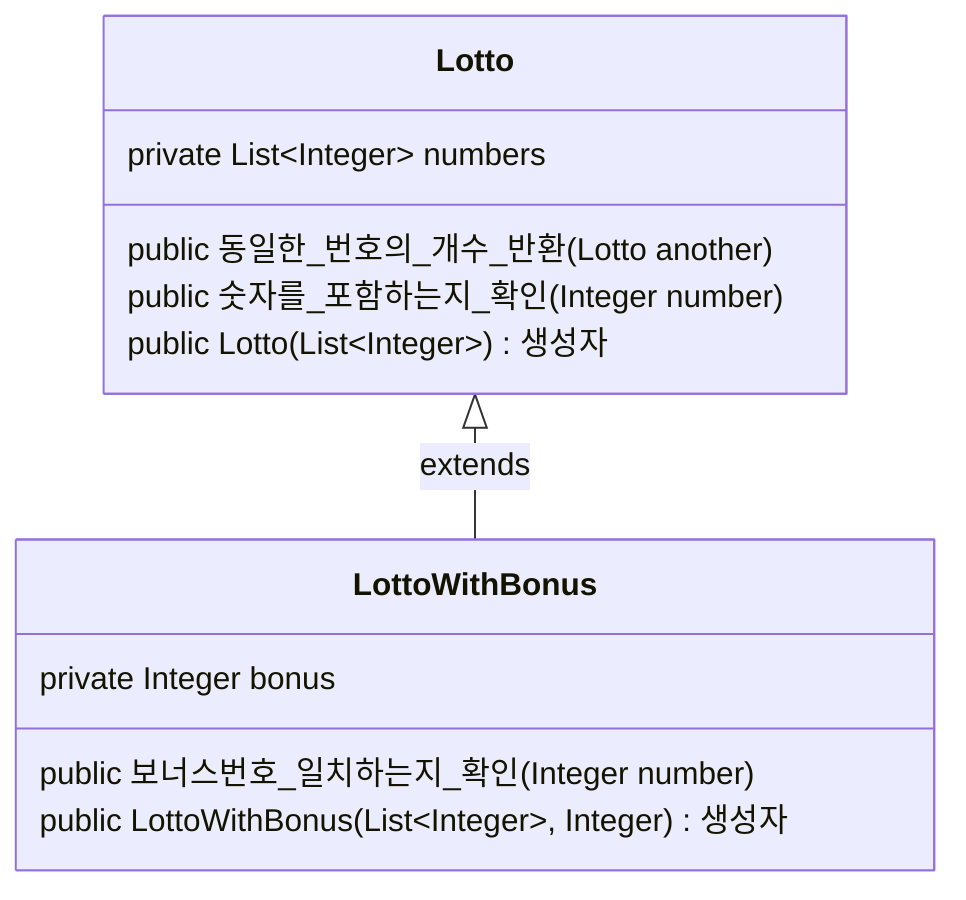

## 상속을 사용한 초기 디자인
이번 과제의 요구사항 중 **로또 번호 5개와 보너스 번호가 일치**하는지 확인하는
부분이 있었다.
이미 로또 번호 6개를 담는 클래스를 정의해둔 상황이었기 때문에,
로또 클래스를 확장하는(상속하는) 새로운 클래스를 정의하여 문제를 해결하려고 하였다.
상속으로 구현하여 Dto에서 새로운 클래스를 그대로 활용하려고 하였다.

```java
// 상속관계이면 LottoWithBonus도 이 Dto 메서드를 사용할 수 있다.
public static LottoDto from(Lotto lotto) {...}

public LottoWithBonus(List<Integer> lotto, Integer bonus) {
	super(lotto);
	this.bonus = bonus;
}
```
문제는 생성자에서 발생했다. Lotto의 numbers 필드는 private 선언되었기 때문에,
하위 클래스인 LottoWithBonus에서 접근할 수 없다.
필드를 protected로 바꾸거나 setter를 정의하여 해결할 수도 있지만,
[이전 글](/우테코/2023/11/07/2-woowacourse-pre3-dto)에서 밝혔듯
캡슐화를 최대한 진행하며 과제를 진행하고 있었다.

LottoWithBonus 객체를 만들기 위해 캡슐화를 포기한다면 요구사항 변화에 대응하기 어려울
것은 확실했다 [[1]]. Lotto 클래스와 LottoWithBonus 클래스 간에 강한 의존성이 생기게 되고,
부모 클래스의 내부 구조가 변하면 하위 클래스의 구현 역시 함께 변경되어야 한다.

## 조합을 사용한 디자인
결국 코드의 재사용을 일부 포기하고 조합으로 디자인을 변경하였다.
```java
class LottoWithBonus {
	// 상속하는 대신 Lotto 클래스를 인스턴스 변수로 가진다.
	private final Lotto lotto;
	private final Integer bonus;
	public Long countSameNumbers(Lotto another) {
		// Lotto 클래스의 데이터에는 제공하는 메서드를 통해 접근한다.
		return another.conutSameNumbers(this.lotto);
	}
}

class LottoResult {
	// Lotto와 LottoWithBonus를 비교하기 위한 새로운 클래스 작성
}
```
코드의 양은 증가했지만, 요구사항 변화에 더 유연하게 설계할 수 있었다.
LottoWithBonus 클래스는 Lotto 클래스의 정보에 메서드를 통해서만 접근하기 때문에,
Lotto의 내부 구현이 int[]나 String으로 바뀌어도 문제가 없을 것이다.

## 쉽게 비교하기
다른 글[[1]], [[2]]에서 상속과 조합을 사용할 곳을 쉽게 판단하는 방법을 찾을 수 있었다.
- **is a** 관계인 경우 상속
- **is part of** 관계인 경우 조합

예를 들어 자바 라이브러리에서 제공하는 **ArrayList**은 **List**의 일종이다(ArrayList *is a* List).

이번 과제에서도 비슷하게 *LottoWithBonus is a Bonus* 관계라고 보일 수 있지만,
사실 정답 로또 + 보너스 번호를 표현할 때 Lotto 클래스를 재사용하고 싶어 나온 결과물이지,
보너스 번호 자체는 로또 객체와 크게 관련이 없다. 로또 용지가 정답의 일부분(*Lotto is part of LottoWithBonus*)
라고 표현하면 정확할 것 같다.

차라리 홀수만 표기된 로또 용지 *OddLotto* 클래스를 만든다면 *OddLotto is a Lotto*라고 표현할 수는 있겠다.


## References
\[1] [상속보다는 조합(Composition)을 사용하자](https://tecoble.techcourse.co.kr/post/2020-05-18-inheritance-vs-composition/)

\[2] [상속(inheritance)과 컴포지션(composition)에 대해서](https://velog.io/@vino661/%EC%83%81%EC%86%8D%EA%B3%BC-%EC%BB%B4%ED%8F%AC%EC%A7%80%EC%85%98%EC%97%90-%EB%8C%80%ED%95%B4%EC%84%9C#%EC%83%81%EC%86%8Dinheritance%EA%B3%BC-%EC%BB%B4%ED%8F%AC%EC%A7%80%EC%85%98composition)

[1]: https://tecoble.techcourse.co.kr/post/2020-05-18-inheritance-vs-composition/
[2]: https://velog.io/@vino661/%EC%83%81%EC%86%8D%EA%B3%BC-%EC%BB%B4%ED%8F%AC%EC%A7%80%EC%85%98%EC%97%90-%EB%8C%80%ED%95%B4%EC%84%9C#%EC%83%81%EC%86%8Dinheritance%EA%B3%BC-%EC%BB%B4%ED%8F%AC%EC%A7%80%EC%85%98composition
