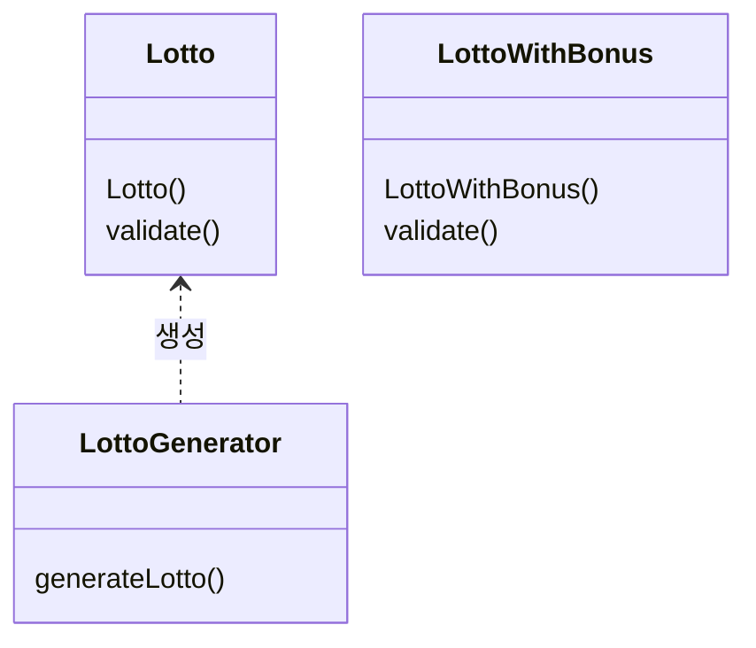
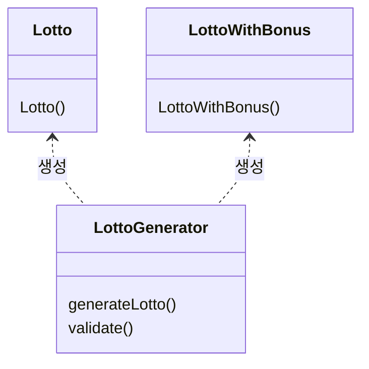

## 프리코스 1주차 돌아보기
1주차에 진행했던 숫자 야구 게임의 코드를 돌아보면, 객체 생성 시에 여러 생성자를 사용했었다.
```java
// 컴퓨터(투수)가 생성한 랜덤 숫자를 담거나,
// 사용자(타자)가 생성한 숫자를 담기 위한 클래스
public class Player {
	private final List<Integer> numbers;

	// 무작위 숫자로 객체 생성
	public Player(총 자릿수, 범위) { ... }

	// 주어진 리스트와 동일하게 객체 생성
	public Player(List<Integer> numbers) { ... }
}

// 사용 예시
Player pitcher = new Player(자릿수 = 3, 범위 = 0~9);  // 무작위 숫자 [3, 2, 7]  생성
Player hitter = new Player(사용자 입력으로부터 구성한 List);  // 사용자가 [1, 2, 3] 입력
// 결과: 1스트라이크, 1볼
```
투수와 타자의 코드를 재사용하고 싶어 Player라는 하나의 클래스로 만들었고,
생성자를 통해 생성 방식을 구분하였다.

하지만 코드를 보면 알 수 있듯이 한 눈에 각자의 역할을 파악하기란 쉽지 않다.
모두 동일한 *Player*라는 이름의 메서드를 사용하고 있어 코드를 작성한 본인 외에는
역할을 알기 힘들었고,
그 점을 보완하기 위해 주석을 덕지덕지 달아야 했다.

이런 문제점을 어떻게 보완할 수 있을까 고민하던 중에, 우테코 프리코스 디코에서 한 가지
정보를 얻을 수 있었다.

## 팩토리 메서드
팩토리 메서드(Factory Method)란 생성자를 대신해 객체 생성의 역할을 하는
메서드이다[[1]]. Effective Java[2]에 따르면 생성자 대신 팩토리 메서드를 사용할 때의 장점이
여럿 있다고 하는데, 그 중 이번 과제에 적용할 수 있던 부분을 소개한다.

### 이름 가지기
이번 3주차에서는 컴퓨터가 생성한 무작위 로또와 사용자가 생성한 정답 로또 용지를
Lotto라는 하나의 클래스로 재사용하였다.
```java
public class Lotto {
	private final List<Integer> numbers;
	public Lotto(List<Integer> numbers) {
		this.numbers = numbers;
	}
}

public class LottoGenerator {
	public static Lotto generateRandomLotto() {...}
	public static Lotto generateAnswerLotto(List<Integer> numbers) {
		return new Lotto(numbers);
	}
}

// 사용 예시
Lotto randomLotto = LottoGenerator.generateRandomLotto();
Lotto lottoFromUserInput = LottoGenerator.generateAnswerLotto(/*리스트*/);
```
1주차 코드와 비교하면 큰 발전이 느껴진다. 한눈에 무슨 역할을 하는 코드인지 알아보기 쉽고,
이후 유지보수하기에도 수월할 것이다.

### 객체 생성 캡슐화
[이전 글](/우테코/2023/11/07/2-woowacourse-pre3-dto)에서 밝힌 것처럼, 이번 과제에는
Dto도 사용되었다. Dto 객체 생성에도 팩토리 메서드를 사용하는 것으로 이번 주차에 특히
집중했던 **캡슐화**라는 목표에 다가설 수 있었다.
```java
public class LottoDto {
	private final String numbers;

	// 생성자는 private으로 두고 외부에서 접근하지 못하게 하였다.
	private LottoDto(Lotto lotto) {...}

	// 외부에서는 팩토리 메서드를 사용해 Dto를 생성할 수 있다.
	public static LottoDto from(Lotto lotto) {
		return new LottoDto(lotto);
	}
}

// 팩토리 메서드를 사용하기 이전 코드
outputView.print(new LottoDto(lotto.toString()));
outputView.print(new LottoDto(lotto.getNumbers()));
// 팩토리 메서드를 적용한 코드
outputView.print(new LottoDto.from(lotto));
```
팩토리 메서드를 사용하기 이전에는, 뷰에 넘겨주기 위한 Dto를 만들 때 getter를 사용해
모델의 내부 구조를 그대로 노출해야 했다. 지금까지의 글에서 계속 언급했듯이, 이는 캡슐화를
깨는 디자인이며 요구사항(모델의 내부 구조)이 변할 경우 많은 코드의 수정을 필요로 한다.

아래처럼 팩토리 메서드를 사용하여 변환 과정을 숨기는 것으로 캡슐화를 유지할 수 있다.

### 코드 재사용
이렇게 [2]에서 소개하는 장점을 과제에 적용하고,
추가로 객체 생성 시 validate 책임도 팩토리 메서드에 위임했다.
이 방법을 통해 [조합 클래스](/우테코/2023/11/08/1-woowacourse-pre3-composition) 객체
생성 시, validate 코드를 재사용할 수 있었다.
- 팩토리 메서드 적용 이전

- 팩토리 메서드 적용 이후


## 3주차를 마치며
이번 주차의 과제를 해결하면서 요구 사항을 만족하기 위해 정말 많은 것을 공부할 수 있었다.
**MVC 패턴, DTO, 조합 클래스, 팩토리 메서드**를 공부해 코드에 적용하고, 블로그에 적용한
내용들을 소개했다.

1주차 코드와 약간 비교해봐도 클린 코드를 향해 나아가고 있다는 느낌이 든다. 언젠가 거대한
프로젝트의 코드에 기여할 때, 이렇게 배운 내용들이 좋은 코드 작성에 도움이 될 것이다.

## Reference
\[1] [정적 팩토리 메서드(Static Factory Method)는 왜 사용할까?](https://tecoble.techcourse.co.kr/post/2020-05-26-static-factory-method/)

\[2] Joshua Bloch, "Effective Java," 2018.

\[3] [팩토리 메서드(Factory Method) 패턴 - 완벽 마스터하기](https://inpa.tistory.com/entry/GOF-%F0%9F%92%A0-%ED%8C%A9%ED%86%A0%EB%A6%AC-%EB%A9%94%EC%84%9C%EB%93%9CFactory-Method-%ED%8C%A8%ED%84%B4-%EC%A0%9C%EB%8C%80%EB%A1%9C-%EB%B0%B0%EC%9B%8C%EB%B3%B4%EC%9E%90)

[1]: https://tecoble.techcourse.co.kr/post/2020-05-26-static-factory-method/