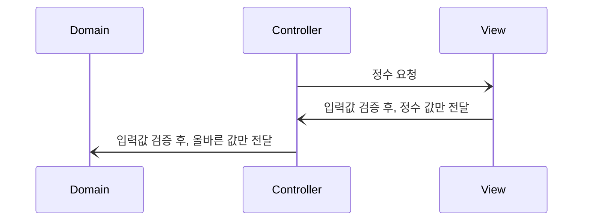
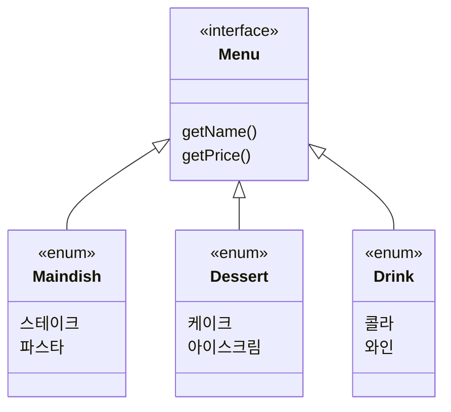

## 공통 피드백
우테코 3주차를 마치고 제공받은 공통 피드백 중, 관심사 분리와 테스트 작성에 관한 내용이
눈에 띄었다.

> 1. 테스트하기 어려운 것은 객체 분리를 고민하라.
> 2. UI 로직이 아니라, 비즈니스 로직에 대한 단위 테스트를 작성하라.
> 3. 테스트 코드도 코드이므로 리팩토링을 통해 개선해야 한다.

## 돌아보는 3주차 코드
3주차 과제에서 사용자에게 입력 받는 코드는 이렇게 구성했다.
```java
// 컨트롤러
public class Controller {
	Money requestMoney() {
		while (true) {
			try {
				// 1000으로 나누어 떨어지지 않는 숫자일 경우,
				// 양수가 아닌 경우,
				// 숫자가 아닌 경우 예외를 던진다.
				return new Money(inputView.requestInteger());
			} catch (IllegalArgumentException e) {
				// 에러 메시지 출력
			}
		}
	}
}

// 뷰
public class InputView {
	public Integer requestInteger() {
		try {
			return Integer.parseInt(Console.readLine());
		} catch (IllegalArgumentException e) {
			// 에러 메시지 출력
		}
	}
}
```
컨트롤러가 실행하는 *requestMoney()* 메서드는 사용자에게 정수 하나를 입력받는다.
이 때 잘못된 입력(정수가 아닌 입력, 범위를 벗어나는 정수 등)이 들어오면 에러 메시지를 출력하고 재시도한다.

그런데 이 코드 구조는 테스트하기 어려웠다.

잘못된 입력 값을 넣었을 때 예외를 잘 던지는지, 올바른 값을 넣었을 때 반환 값은 일치하는지 검사하고 싶다.
하지만 *requesInteger()* 메서드는 입력값을 파라미터로 받지 않고 내부적으로 Console.readLine()을 호출해 입력을 받는다.

requestMoney() 메서드 역시 비슷한 방식이고, 심지어 원하는 입력을 받을 때까지 while문을 돌고 있다.

물론 전체 프로젝트를 작성한 뒤에 손으로 직접 테스트는 할 수 있지만,
해당 메서드만 따로 반복적으로 테스트하기 어렵다.
```java
@DisplayName("숫자가 아닌 구입 금액을 입력하는 경우")
@Test
void requestIntegerTest() {
	InputView inputView = InputView.getInstance();
	String input = "\n";
	InputStream in = new ByteArrayInputStream(input.getBytes());
	System.setIn(in);
	OutputStream out = new ByteArrayOutputStream();
	System.setOut(new PrintStream(out));

	assertThatThrownBy(inputView::requestInteger)
			.isInstanceOf(IllegalArgumentException.class)
			.hasMessageContaining("정수를 입력해야 합니다.");

	Console.close();
}
```
어쩔 수 없이 3주차 테스트 코드에서는 stdin에 특정 입력을 주고, requestInteger() 메서드를 실행했을 때
stdout에서 원하는 출력이 나오는지 테스트하였다.
피드백 2에서 언급하는, **지양해야 할** UI 로직 테스트라고 볼 수 있겠다.

requestMoney() 메서드의 테스트는 작성하지 못했다. 잘못된 입력값만을 주면 반복문을 절대
탈출할 수가 없으므로, 원하는 단위 테스트를 작성할 수가 없었다.

## 좋은 단위 테스트
4주차 과제에서 어떻게 피드백을 반영해서 더 좋은 테스트를 만들었는지 소개하려고 한다.
(이제 와서 3주차 코드를 보면 컨트롤러에서 입력값 유효성을 판단하는 것도 문제 같지만,
이번 포스트에서는 다루지 않으려고 한다.)

### 메서드 분리하기
이번 과제에는 문자열을 *메뉴이름-개수,메뉴이름-개수, ...* 형식으로 입력받는 부분이 있었다.
이때 입력 형식이 다르거나, 판매하지 않는 메뉴이거나, 개수가 적절하지 않으면 예외를 던지고 다시 입력받아야 했다.

3주차처럼 이 요구사항 전체를 실행하는 메서드 *requestMenu()*를 만들면 테스트하기 어려울 것이다.
좀 더 작은 단위로 쪼개면서 입출력을 확인하기 쉽도록 바꿔야 한다.

먼저 stdin에서 입력을 받는 부분,
그리고 성공적인 입력을 받을 때까지 반복하는 부분은 테스트하기 어렵다.
이 두 부분을 메서드로 분리하고, 뷰에 위임하였다.
```java
public class InputView {
	// 컨트롤러에서 호출할 함수
	public EntireOrder requestOrders() {
		System.out.println( /* 안내 메시지 출력 */ );
		return tryUnitilSuccessOrder();
	}

	private EntireOrder tryUntilSuccessOrder() {
		try {
			// 도메인에게 입력받은 문자열을 전달한다.
			// 도메인에서 유효성 처리를 하고, 적절하지 않으면 에러를 던질 것이다.
			return MenuReader.readOrders(Console.readLine());
		} catch (IllegalArgumentException e) {
			System.out.println( /* 에러 메시지 출력 */ );
		}
		// 에러가 던져졌으면 다시 한번 실행한다.
		return tryUntilSuccessOrder();
	}
}
```
이 메서드에 대한 테스트는 작성하지 않을 것이다.
내부 로직은 포함하지 않도록 하고, 최소한의 일만 하도록 분리한다.

뷰 부분에 대한 테스트를 굳이 하지 않아도, 유효성을 검증하는 *MenuReader.readOrders()*가
반복적으로 잘 작동하는지 확인하면 된다.

readOrders() 메서드도 작은 단위로 쪼개서 테스트하기 쉽게 만든다.
```java
// 입력 문자열: 메뉴이름1-개수1,메뉴이름2-개수2, ...
public static EntireOrder readOrders(String line) {
	// 1. 정규식으로 형식 검증
	validatePattern(line);

	// 2. , 문자 기준으로 split
	List<Order> orders = Arrays.stream(line.split(ORDER_SEPARATOR))
			.map(MenuReader::readSingleOrder)
			.toList();

	// 6. 중복 메뉴 검증
	validateOrdersDistinct(orders);
	// 7. 전체 주문 개수 검증 (주문이 20개를 넘으면 무효)
	validateOrdersSize(orders);
	// 8. Drink 주문만 있으면 무효
	validateOrdersWithNonDrink(orders);

	return new EntireOrder(orders);
}

// 입력 문자열: 메뉴이름-개수
public static Order readSingleOrder(String line) {
	String[] tokens = line.split(MENU_SEPARATOR);
	// 3. - 문자 기준으로 split
	validateTokenSize(tokens);

	// 4. 메뉴 이름 검증
	Menu menu = readMenuName(tokens[0]);
	// 5. 개수 검증
	Integer count = readCount(tokens[1]);

	return new Order(menu, count);
}
```
이렇게 개별 기능을 처리하는 메서드를 따로 만들어주고, readOrders() 메서드는 개별 메서드를
실행해주도록 만들었다.

3주차 코드의 경우 모든 검증을 생성자에서 진행했지만,
4주차 코드에서는 validate 메서드를 모두 분리하여 실행을 마친 후
정상적인 입력값만 생성자로 넘겨주도록 변경하였다.

예를 들어 *스테이크-1,케이크-2,콜라-3*이라는 전체 입력(*EntireOrder*)을 받아,
각 주문(*Order*, 스테이크-1)을 파싱하고,
메뉴 이름(*Menu*, 스테이크)을 파싱하는 부분(*4. 메뉴 이름 검증*)을 테스트하려고 한다.



이런 식으로 클래스를 구성하고, 주어진 문자열과 일치하는 메뉴가 존재하면
해당하는 Enum을 반환하는 메서드를 만들었다.
```java
public static Menu readMenuName(String name) {
	return Stream.of(Maindish.values(), Dessert.values(), Drink.values())
			.flatMap(Stream::of)
			.filter(i -> i.getName().equals(name))
			.findFirst()
			.orElseThrow(() -> new IllegalArgumentException(MENU_EXCEPTION));
}
```
이제 이 메서드를 테스트하기는 쉽다. *메뉴이름-숫자* 부분에서 자른 메뉴이름 String을 입력으로 넣고,
예상하는 객체가 반환되는지 혹은 적절히 예외를 던지는지 확인하면 된다.

readOrders() 메서드의 다른 부분도 같은 방식으로 단위 기능을 만들고, 테스트를 작성하면 된다.

### 테스트 코드의 중복 제거
> 테스트 코드도 코드이고, 리팩토링을 통해 개선해야 한다.
> 특히 반복해서 실행하는 부분의 중복을 제거하라.
> <cite>3주차 공통 피드백</cite>

피드백에서는 중복을 제거하는 방법 중 하나로 **ParameterizedTest**를 소개했고,
4주차 과제를 진행하면서 이것의 강력함을 맛볼 수 있었다.

3주차 테스트 코드 일부를 소개한다.
```java
@DisplayName("중복 번호 확인")
@Test
void checkDuplicatedNumbers() {
	List<Integer> numbers = List.of(1, 1, 2, 3, 4, 5);
	assertThatThrownBy(() -> LottoGenerator.generateAnswerLotto(numbers))
			.isInstanceOf(IllegalArgumentException.class)
			.hasMessageContaining("중복된 번호가 존재합니다.");
}
```
로또 번호로 사용할 숫자를 6개 입력받는데,
중복 번호를 전달했을 경우 예외를 잘 던지는지 확인하는 테스트이다.
이 코드에서 다른 번호를 테스트하고 싶다면, 똑같은 코드를 중복해서 넣어야 한다.
```java
@DisplayName("중복 번호 확인")
@Test
void checkDuplicatedNumbers() {
	List<Integer> numbers = List.of(1, 1, 2, 3, 4, 5);
	List<Integer> numbers2 = List.of(6, 7, 10, 10, 10, 10);
	// numbers3, numbers4, ...
	assertThatThrownBy(() -> LottoGenerator.generateAnswerLotto(numbers))
			.isInstanceOf(IllegalArgumentException.class)
			.hasMessageContaining("중복된 번호가 존재합니다.");
	assertThatThrownBy(() -> LottoGenerator.generateAnswerLotto(numbers2))
			.isInstanceOf(IllegalArgumentException.class)
			.hasMessageContaining("중복된 번호가 존재합니다.");
	// assert number3, number4, ...
}
```

Junit의 PamareterizedTest를 활용하면 코드 중복을 크게 줄일 수 있다.
```java
@DisplayName("입력 형식이 다른 주문")
@ValueSource(strings = {"양송이수프-1-2", "초코케이크 1", "-1", "5-바비큐립", "제로콜라--10", "제로콜라-", "타파스-1,,,"})
@ParameterizedTest
void illegalFormatOrder(String input) {
	assertThatThrownBy(() -> MenuReader.readSingleOrder(input))
			.isInstanceOf(IllegalArgumentException.class)
			.hasMessageContaining(MENU_EXCEPTION);
}
```
특히 위에서 정규식을 활용해 입력 형식을 검증하는 부분이 있었는데,
정규식을 정확히 작성했는지 검증하기 위해서 많은 입력값을 테스트해봐야 한다.
여기서 중복 코드를 삽입하는 대신, 입력 문자열을 **ValueSource**로 제공하면
JUnit이 각 파라미터를 자동으로 입력하여 테스트를 실행해준다.


**MethodSource**를 활용하면 출력값 역시 확인할 수 있다.
아래는 readMenuName() 메서드가 맞는 클래스를 반환했는지 확인하는 테스트이다.
```java
private static Stream<Arguments> menuSubclassProvider() {
	return Stream.of(
			Arguments.of("양송이수프", Appetizer.class, "양송이수프"),
			Arguments.of("바비큐립", Maindish.class, "바비큐립"),
			Arguments.of("초코케이크", Dessert.class, "초코케이크"),
			Arguments.of("샴페인", Drink.class, "샴페인")
	);
}

@DisplayName("정상 메뉴")
@MethodSource("menuSubclassProvider")
@ParameterizedTest
void normalMenu(String input, Class<? extends Menu> expectedClass, String expectedName) {
	Menu menu = MenuReader.readMenuName(input);
	assertThat(expectedClass).isEqualTo(menu.getClass());
	assertThat(expectedName).isEqualTo(menu.getName());
}
```


## 마치며
이렇게 4주차에는 잘 분리된 단위 테스트를 만들면서 과제를 진행했는데,
덕분에 생각지도 못했던 버그를 잡거나 편하게 리팩토링할 수 있었다.